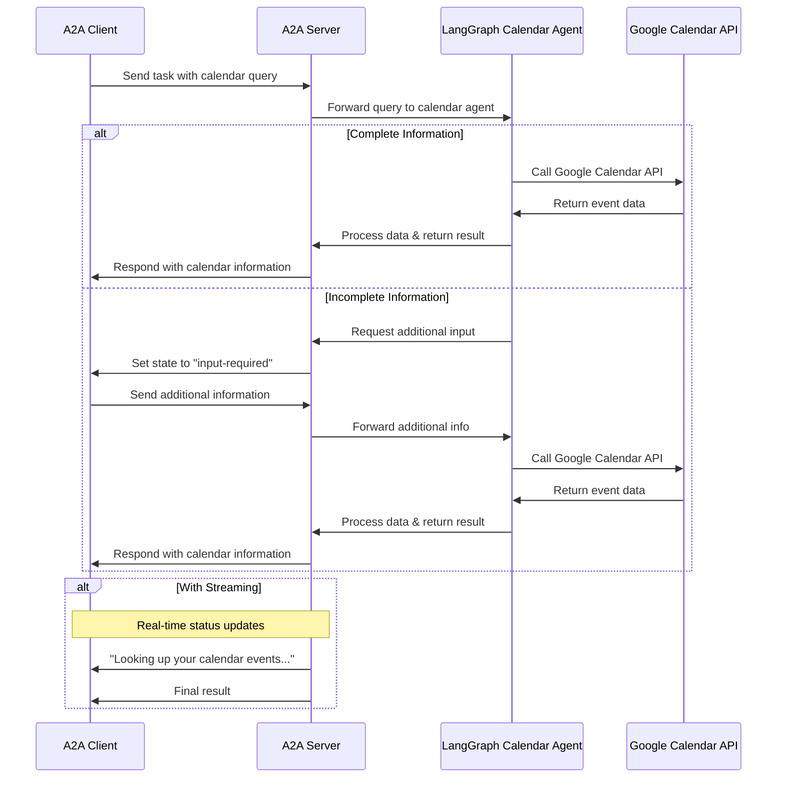

# LangGraph Calendar Agent with A2A Protocol

This sample demonstrates a calendar tracking and day planner agent built with [LangGraph](https://langchain-ai.github.io/langgraph/) and exposed through the A2A protocol. It showcases conversational interactions with support for multi-turn dialogue and streaming responses, powered by the Google Calendar API.

## How It Works

This agent uses LangGraph and the Google Calendar API to provide information about your upcoming events, daily schedule, and meetings. The A2A protocol enables standardized interaction with the agent, allowing clients to send requests and receive real-time updates.



## Key Features

- **Multi-turn Conversations**: Agent can request additional information when needed
- **Real-time Streaming**: Provides status updates during processing
- **Push Notifications**: Support for webhook-based notifications
- **Conversational Memory**: Maintains context across interactions
- **Google Calendar Integration**: Reads your upcoming events and meetings

## Prerequisites

- Python 3.13 or higher
- [UV](https://docs.astral.sh/uv/)
- Google Cloud project with Calendar API enabled
- `credentials.json` for OAuth2 (download from Google Cloud Console)

## Setup & Running

1. Navigate to the samples directory:

   ```bash
   cd samples/python/agents/langgraph
   ```

2. Place your `credentials.json` (Google OAuth2 client secrets) in this directory.

3. Run the agent:

   ```bash
   # Basic run on default port 10000
   uv run .

   # On custom host/port
   uv run . --host 0.0.0.0 --port 8080
   ```

4. In a separate terminal, run an A2A [client](/samples/python/hosts/README.md):

   ```bash
   uv run hosts/cli
   ```

5. On first run, a browser window will open for Google authentication. Approve access to your calendar.

## Technical Implementation

- **LangGraph Agent**: Handles multi-turn, streaming, and memory
- **Google Calendar API**: Fetches and summarizes your next 10 events
- **Push Notification System**: Webhook-based updates with JWK authentication
- **A2A Protocol Integration**: Full compliance with A2A specifications

## Limitations

- Only supports text-based input/output (no multi-modal support)
- Requires Google OAuth2 authentication on first run
- Memory is session-based and not persisted between server restarts
- Only reads events (no event creation or editing)

## Examples

**Synchronous request**

Request:

```
POST http://localhost:10000
Content-Type: application/json

{
  "jsonrpc": "2.0",
  "id": 11,
  "method": "tasks/send",
  "params": {
    "id": "129",
    "sessionId": "8f01f3d172cd4396a0e535ae8aec6687",
    "acceptedOutputModes": [
      "text"
    ],
    "message": {
      "role": "user",
      "parts": [
        {
          "type": "text",
          "text": "What are my events today?"
        }
      ]
    }
  }
}
```

Response:

```
{
  "jsonrpc": "2.0",
  "id": 11,
  "result": {
    "id": "129",
    "status": {
      "state": "completed",
      "timestamp": "2025-06-16T09:00:00.000000"
    },
    "artifacts": [
      {
        "parts": [
          {
            "type": "text",
            "text": "Here are your next events:\n2025-06-16T10:00:00Z: Team Standup\n2025-06-16T13:00:00Z: Project Review"
          }
        ],
        "index": 0
      }
    ],
    "history": []
  }
}
```

**Multi-turn example**

Request - Seq 1:

```
POST http://localhost:10000
Content-Type: application/json

{
  "jsonrpc": "2.0",
  "id": 10,
  "method": "tasks/send",
  "params": {
    "id": "130",
    "sessionId": "a9bb617f2cd94bd585da0f88ce2ddba2",
    "acceptedOutputModes": [
      "text"
    ],
    "message": {
      "role": "user",
      "parts": [
        {
          "type": "text",
          "text": "Show me my meetings tomorrow."
        }
      ]
    }
  }
}
```

Response - Seq 2:

```
{
  "jsonrpc": "2.0",
  "id": 10,
  "result": {
    "id": "130",
    "status": {
      "state": "completed",
      "timestamp": "2025-06-16T09:00:00.000000"
    },
    "artifacts": [
      {
        "parts": [
          {
            "type": "text",
            "text": "Here are your next events:\n2025-06-17T09:00:00Z: 1:1 with Manager\n2025-06-17T15:00:00Z: Doctor Appointment"
          }
        ],
        "index": 0
      }
    ],
    "history": []
  }
}
```

**Streaming example**

Request:

```
{
  "jsonrpc": "2.0",
  "id": 12,
  "method": "tasks/sendSubscribe",
  "params": {
    "id": "131",
    "sessionId": "cebd704d0ddd4e8aa646aeb123d60614",
    "acceptedOutputModes": [
      "text"
    ],
    "message": {
      "role": "user",
      "parts": [
        {
          "type": "text",
          "text": "What's on my calendar next week?"
        }
      ]
    }
  }
}
```

Response:

```
data: {"jsonrpc":"2.0","id":12,"result":{"id":"131","status":{"state":"working","message":{"role":"agent","parts":[{"type":"text","text":"Looking up your calendar events..."}]},"timestamp":"2025-06-16T09:00:00.000000"},"final":false}}

data: {"jsonrpc":"2.0","id":12,"result":{"id":"131","artifact":{"parts":[{"type":"text","text":"Here are your next events:\n2025-06-23T11:00:00Z: Sprint Planning\n2025-06-23T14:00:00Z: Dentist Appointment"}],"index":0,"append":false}}}

data: {"jsonrpc":"2.0","id":12,"result":{"id":"131","status":{"state":"completed","timestamp":"2025-06-16T09:00:01.000000"},"final":true}}
```

## Learn More

- [A2A Protocol Documentation](https://google.github.io/A2A/#/documentation)
- [LangGraph Documentation](https://langchain-ai.github.io/langgraph/)
- [Google Calendar API](https://developers.google.com/calendar/api)
